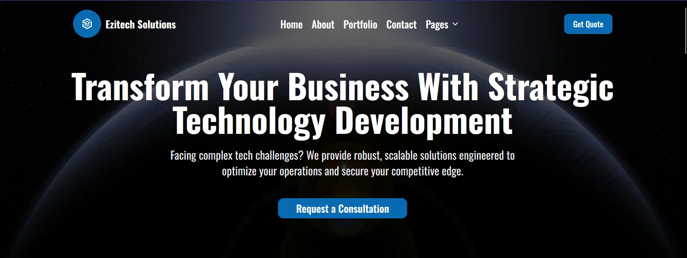

# Ezitech Solutions

<div align="center">
  
  <p>A modern, responsive web application built with Next.js 15 and Tailwind CSS</p>

  [](https://nextjs.org/)
  [](https://reactjs.org/)
  [](https://www.typescriptlang.org/)
  [](https://tailwindcss.com/)
</div>

## 📋 Overview

Ezitech Solutions is a comprehensive business website featuring various sections including a blog, career portal, portfolio showcase, and contact information. The application is built with modern web technologies focusing on performance, accessibility, and responsive design.

## ✨ Features

- **Modern UI Components** - Built with Radix UI primitives and styled with Tailwind CSS
- **Dark/Light Mode** - Seamless theme switching with next-themes
- **Responsive Design** - Mobile-first approach ensuring compatibility across all devices
- **Blog System** - Content management with Markdown support via react-markdown
- **Portfolio Showcase** - Display your projects with beautiful layouts
- **Career Portal** - Job listings and application system
- **Contact Form** - React Hook Form with Zod validation
- **Animations** - Smooth motion effects with motion library

## 🛠️ Tech Stack

- **Framework**: [Next.js 15](https://nextjs.org/)
- **Language**: [TypeScript](https://www.typescriptlang.org/)
- **Styling**: [Tailwind CSS 4](https://tailwindcss.com/)
- **UI Components**: [Radix UI](https://www.radix-ui.com/)
- **Form Handling**: [React Hook Form](https://react-hook-form.com/)
- **Validation**: [Zod](https://zod.dev/)
- **Carousel**: [Embla Carousel](https://www.embla-carousel.com/)
- **Markdown**: [React Markdown](https://github.com/remarkjs/react-markdown)
- **Icons**: [Lucide React](https://lucide.dev/)
- **Animation**: [Motion](https://motion.dev/)

## 🚀 Getting Started

### Prerequisites

- Node.js 18.x or later
- pnpm (recommended) or npm/yarn

### Installation

1. Clone the repository:

   ```bash
   git clone https://github.com/codewithnuh/ezitech-solutions.git
   cd ezitech-solutions
   ```

2. Install the dependencies:

   ```bash
   pnpm install
   # or
   npm install
   # or
   yarn install
   ```

3. Run the development server:

   ```bash
   pnpm dev
   # or
   npm run dev
   # or
   yarn dev
   ```

4. Open [http://localhost:3000](http://localhost:3000) with your browser to see the result.

## 📂 Project Structure

```
├── app                  # Next.js app directory (pages and routes)
│   ├── blog             # Blog section
│   ├── career           # Career portal
│   ├── contact          # Contact page
│   ├── portfolio        # Portfolio showcase
│   └── page.tsx         # Homepage
├── components           # Reusable UI components
│   ├── globals          # Global components (header, footer)
│   ├── screens          # Page-specific components
│   ├── shared           # Shared components across screens
│   └── ui               # UI primitives and base components
├── constants            # Application constants and content
├── data                 # Static data files
├── hooks                # Custom React hooks
├── lib                  # Utility functions and helpers
└── public               # Static assets
```

## 🔧 Configuration

The project uses several configuration files:

- `next.config.ts` - Next.js configuration
- `tsconfig.json` - TypeScript configuration
- `components.json` - UI components configuration
- `postcss.config.mjs` - PostCSS configuration for Tailwind

## 🎨 Customization

### Theming

The project uses a customizable theme with colors defined in Tailwind CSS. The primary color is set to `oklch(0.513 0.1371 248.72)`.

You can modify the theme by editing:

- Tailwind configuration
- `components/theme-provider.tsx` for theme settings

### Content

Update the content in the `constants/content` directory to customize the website text and data.

## 📱 Responsive Design

The application is built with a mobile-first approach using the custom `use-mobile.ts` hook to detect device types and adapt the UI accordingly.

## 🔄 State Management

React's built-in state management is used throughout the application with custom hooks for specific functionality.

## 🚢 Deployment

The application can be deployed on Vercel with minimal configuration:

1. Build the application:

   ```bash
   pnpm build
   # or
   npm run build
   # or
   yarn build
   ```

2. Deploy to Vercel:
   - Connect your GitHub repository to Vercel
   - Configure environment variables if needed
   - Deploy with default settings

## 📄 License

This project is licensed under the MIT License - see the LICENSE file for details.

## 👥 Contributing

Contributions are welcome! Please feel free to submit a Pull Request.

1. Fork the project
2. Create your feature branch (`git checkout -b feature/amazing-feature`)
3. Commit your changes (`git commit -m 'Add some amazing feature'`)
4. Push to the branch (`git push origin feature/amazing-feature`)
5. Open a Pull Request

## 📞 Contact

For any inquiries, please reach out through the contact form on the website or open an issue in the GitHub repository.

---
